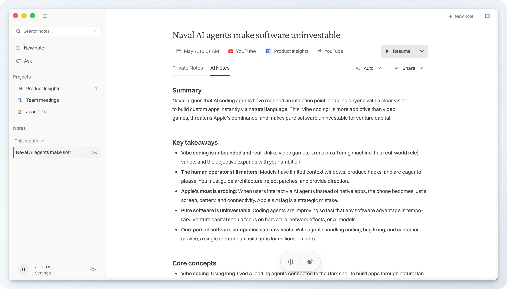
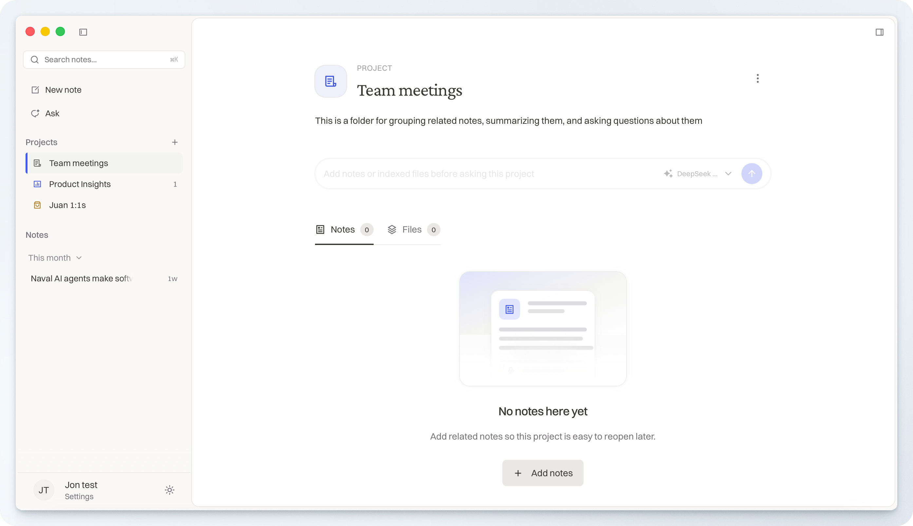
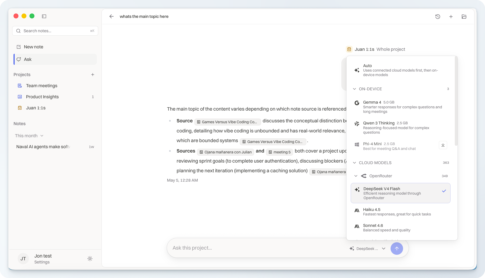
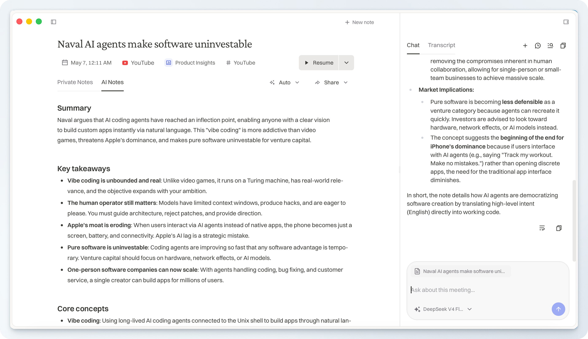

# Typr OSS

Open-source AI meeting notes with local storage, on-device models, and optional bring-your-own-key cloud providers.

Typr helps you capture meetings, transcribe audio, ask questions about your notes, and turn conversations into follow-up work. The OSS edition is built so your notes live on your machine, cloud AI calls use your own provider keys, and the app does not depend on Typr-hosted model proxies or commercial billing infrastructure.

If you are looking for a privacy-first Granola alternative, Typr OSS gives you an open-source desktop app you can inspect, self-build, and run with local-first defaults.

<p align="center">
  
</p>

<p align="center">
  
  
</p>

<p align="center">
  
</p>

## Why Typr

- Local-first notes and transcripts backed by local SQLite storage.
- On-device speech-to-text and chat models for offline or private workflows.
- Direct BYOK integrations for OpenAI, Groq, OpenRouter, and AssemblyAI.
- Meeting-aware notes, summaries, Ask, projects, templates, tags, and Obsidian export.
- No Typr-owned AI proxy, maintainer API keys, Stripe, Keygen, or private model storage in the OSS build.

## What You Can Do

- Record and transcribe meetings.
- Import YouTube videos or uploaded audio.
- Ask questions about a meeting, project, or note history.
- Generate summaries, action items, and follow-up drafts.
- Build project briefs from included notes and files, then use that compiled context in project chats.
- Use local models from public Hugging Face repositories.
- Connect cloud models directly with your own API keys.
- Export notes to Obsidian or share them as local artifacts.

## Models

Typr OSS supports local models and BYOK cloud providers.

- Local speech-to-text models are Whisper GGML files downloaded from public Hugging Face repositories.
- Local chat models on macOS are GGUF models downloaded from public Hugging Face repositories.
- Cloud chat uses OpenAI, Groq, or OpenRouter directly with your own API key.
- Cloud transcription uses AssemblyAI directly with your own API key.
- Windows builds are cloud-first today; local models are hidden until local inference is dependable across more Windows devices.

See [docs/models.md](docs/models.md) for the current model list, provider endpoints, and platform notes.

## Projects And Ask

Projects are more than folders. Typr compiles included notes and indexed files into source digests, synthesizes a cited project brief from those digests, and uses the brief plus compiled source context when answering project chats. This is inspired by Andrej Karpathy's [LLM wiki idea](https://gist.github.com/karpathy/442a6bf555914893e9891c11519de94f): keep reusable project memory instead of re-deriving every answer from raw chunks.

See [docs/project-knowledge.md](docs/project-knowledge.md) for the project knowledge pipeline.

## Privacy Model

Typr OSS does not ship maintainer-owned AI keys. When you choose a cloud provider, the desktop app calls that provider directly with the key you add in Settings > AI models. When you choose local models, the model files are downloaded from public Hugging Face repositories and run on your device.

## Platform Support

- macOS supports on-device models and BYOK cloud providers.
- Windows builds are cloud-first today: chat works through OpenAI, Groq, and OpenRouter keys, and transcription works through AssemblyAI. Local models are not exposed in the Windows build yet because performance and runtime compatibility vary too much across Windows devices. Contributions that make local Windows inference dependable are welcome.

For OSS/commercial boundaries and removed infrastructure, see [docs/oss-sanitization.md](docs/oss-sanitization.md).

## Project Status

The repo is being prepared for public OSS distribution. Use a fresh clone and review [docs/setup.md](docs/setup.md) before building locally. Maintainer release requirements are documented in [docs/release.md](docs/release.md).

## Install

Download signed macOS builds and the Windows installer from [GitHub Releases](https://github.com/juanmaramos/typr-oss/releases/latest).

macOS users can also install with Homebrew:

```bash
brew install --cask juanmaramos/typr/typr
```

## Quick Start

Requirements:

- Rust stable toolchain
- Node.js and `pnpm`
- Xcode command line tools on macOS
- `cmake`
- `libomp` for local LLM support

Setup:

```bash
cp .env.example .env
pnpm install
pnpm -F @typr/desktop tauri:dev
```

Add cloud API keys in Settings > AI models after the app starts, or download local models from the same screen.

Useful checks:

```bash
pnpm -F @typr/desktop typecheck
cargo check
```

More setup notes are in [docs/setup.md](docs/setup.md).

## Releases And Signing

Official Typr OSS macOS releases are signed, notarized, and published through GitHub Releases by project maintainers using repository secrets. Those secrets are not exposed to forks or community builds.

Forks and community builds must use their own signing identities or distribute unsigned builds.

## Security

Please report vulnerabilities privately. See [SECURITY.md](SECURITY.md).

## License

This project is licensed under the GNU General Public License v3.0. See [LICENSE](LICENSE).

## Notices

Third-party and upstream notices are listed in [NOTICE](NOTICE).
